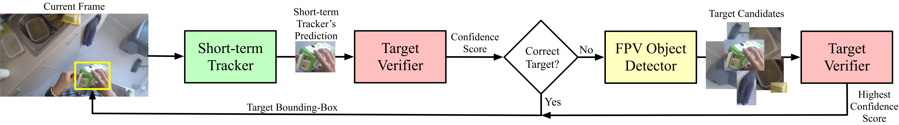

# Implementation of FPV trackers
This repository contains the implementations of the tracking algorithms LTMU-H and TbyD-H presented in the paper "Visual Object Tracking in First Person Vision" appearing in the International Journal of Computer Vision (IJCV).

<!-- start badges -->
[](https://arxiv.org/abs/2209.13502)
[](http://arxiv.org/abs/2108.13665)
<!-- end badges -->



Refer to the respective ```README.md``` present in the ```LTMU-H``` and ```TbyD-H``` folders to know how to run each of the trackers.

## Authors
Matteo Dunnhofer (1)
Antonino Furnari (2)
Giovanni Maria Farinella (2)
Christian Micheloni (1)

* (1) Machine Learning and Perception Lab, University of Udine, Italy
* (2) Image Processing Laboratory, University of Catania, Italy

**Contact:** [matteo.dunnhofer@uniud.it](mailto:matteo.dunnhofer@uniud.it)


## Citing
When using the code, please reference:

```
@Article{TREK150ijcv,
author = {Dunnhofer, Matteo and Furnari, Antonino and Farinella, Giovanni Maria and Micheloni, Christian},
title = {Visual Object Tracking in First Person Vision},
journal = {International Journal of Computer Vision (IJCV)},
year = {2022}
}

@InProceedings{TREK150iccvw,
author = {Dunnhofer, Matteo and Furnari, Antonino and Farinella, Giovanni Maria and Micheloni, Christian},
title = {Is First Person Vision Challenging for Object Tracking?},
booktitle = {Proceedings of the IEEE/CVF International Conference on Computer Vision (ICCV) Workshops},
month = {Oct},
year = {2021}
}
```

## License
All files in this dataset are copyright by us and published under the 
Creative Commons Attribution-NonCommercial 4.0 International License, found 
[here](https://creativecommons.org/licenses/by-nc/4.0/).
This means that you must give appropriate credit, provide a link to the license,
and indicate if changes were made. You may do so in any reasonable manner,
but not in any way that suggests the licensor endorses you or your use. You
may not use the material for commercial purposes.

Copyright © Machine Learning and Perception Lab - University of Udine - 2021 - 2022